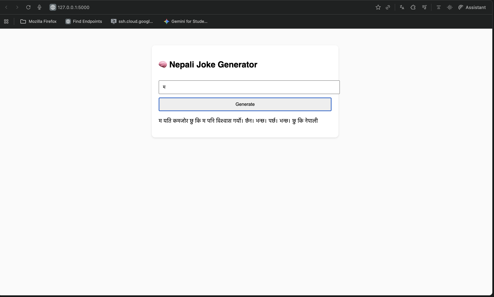

# Next-Word Predictor Using RNN (From Scratch in NumPy)

A **from-scratch implementation** of a Recurrent Neural Network (RNN) for predicting the next word in a sequence, **purely in Python + NumPy**. No TensorFlow, no PyTorch—just raw matrix operations, backpropagation, and good old-fashioned math.

This project demonstrates the full pipeline of building an RNN: **embedding words, sequential processing, backpropagation through time, and inference**. Perfect for portfolio showcasing, technical interviews, or anyone curious about how RNNs work under the hood.

---

## 🚀 Features

- Implements a simple RNN from scratch with **NumPy**.
- Trains on a custom dataset of text.
- Saves model parameters (`Wx`, `Wh`, `Why`, `E`) for inference.
- Handles sequential data **word by word**.
- Includes **forward pass, backward pass, and gradient clipping**.
- Demonstrates **checkpointing** to save and resume training.
- Generates next words for a given input sequence (inference mode).

---

## 🧠 How It Works

### 1. Word Embeddings
- Each word in the vocabulary is converted into a dense vector.
- Embedding matrix `E` is learned during training.

```
x_t = E[:, word_index]
```

### 2. RNN Forward Pass
- Hidden state updates with:
```
h_t = tanh(W_x * x_t + W_h * h_{t-1} + b_h)
```
- Output layer produces logits:
```
y_t = W_y * h_t + b_y
```
- Apply softmax to get probability distribution over next words.

### 3. Loss Function
- Cross-entropy loss is used:
```
L = -sum(y_i^true * log(y_hat_i))
```

### 4. Backpropagation Through Time (BPTT)
- Gradients computed chain-rule style through time.
- Gradients are clipped to prevent exploding gradients.
- Update weights with simple stochastic gradient descent:
```
W := W - learning_rate * (dL/dW)
```

### 5. Inference
- Feed one word at a time, propagate hidden states, pick the word with max probability.
- Generates text word by word, mimicking learned patterns.

---

## 🛠️ Setup & Usage

```bash
# Clone the repo
git clone git@github.com:Nishaan-Ghimire/RNN-from-scratch.git
cd RNN-from-scratch

# Install requirements
pip install -r requirements.txt

# Train the model
python3 train.py

# Generate text
python3 app.py
```

---

## 📊 Model Parameters

- `Wx` → Input to hidden weight matrix
- `Wh` → Hidden to hidden weight matrix
- `Why` → Hidden to output weight matrix
- `E` → Word embedding matrix
- `b_h`, `b_y` → Bias terms

Saved as `.npy` files for easy reuse and deployment.

---

## ✨ Highlights

- **Pure NumPy implementation**: no high-level libraries, everything from scratch.
- **Readable & modular code**: easy for anyone to tweak or expand.
- **Educational**: perfect for understanding the inner mechanics of RNNs and text generation.
- **Portfolio-ready**: shows understanding of both math and code—recruiters love this.

---

## 📂 Dataset

You can use any text dataset. For demonstration, we used a small collection of jokes/text snippets. Data is preprocessed into sequences for training.

---

## 💡 Future Improvements

- Implement LSTM / GRU for better memory.
- Increase vocabulary and dataset for more realistic predictions.
- Add temperature sampling for more creative text generation.

---

## ⚡ Why This Project Matters

Shows your ability to go low-level and understand deep learning fundamentals. Most candidates rely on frameworks; this project proves you can build models from first principles.

---

## 📝 License

MIT License - feel free to use and modify.

---

## 🤝 Contributing

Contributions welcome! Feel free to open issues or submit pull requests.

---

**Made with 🧠 and NumPy**

## Sample output


